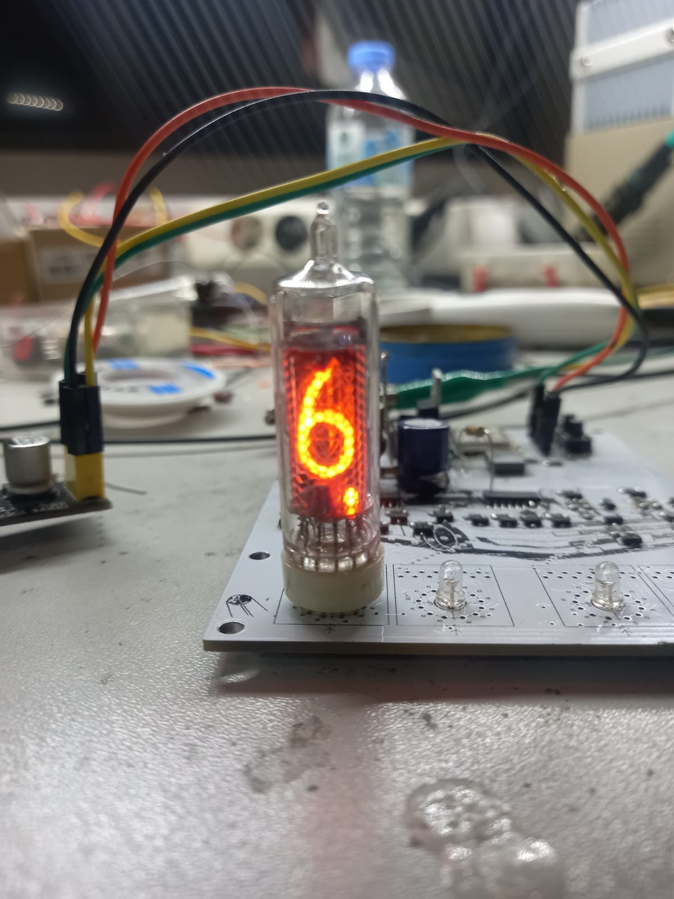
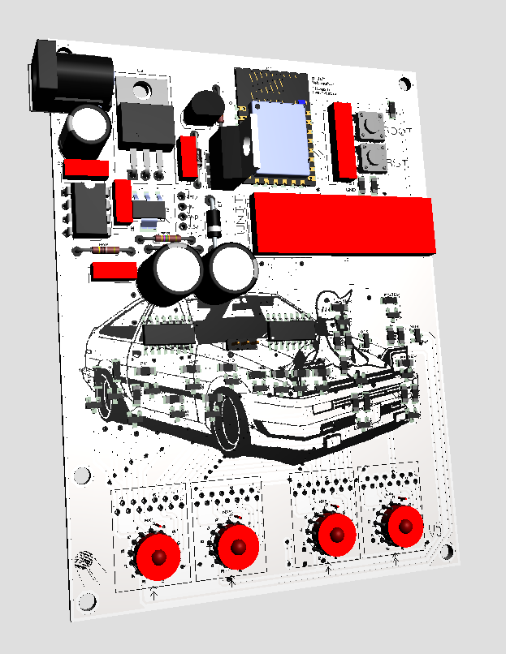
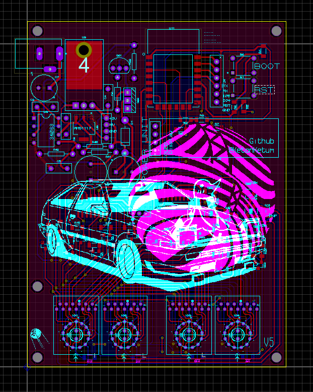
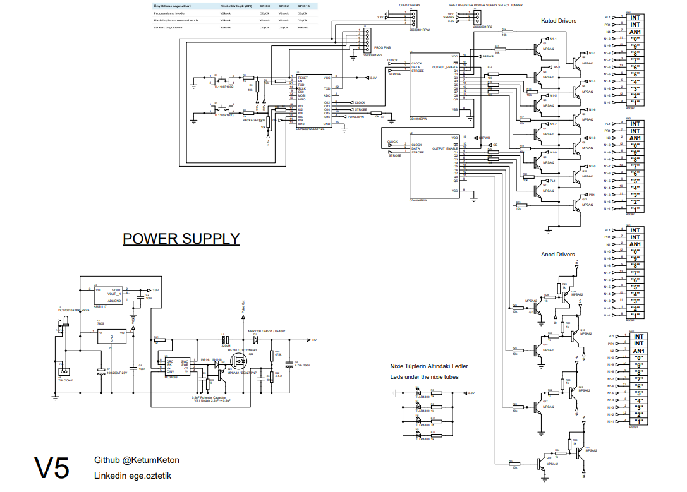
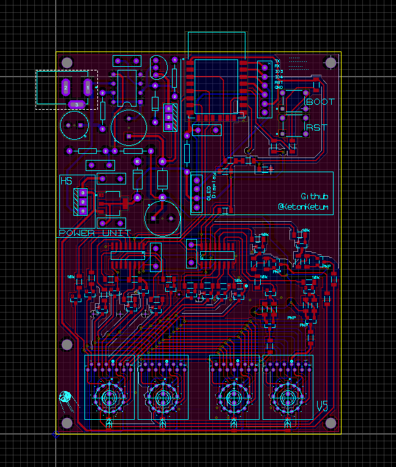
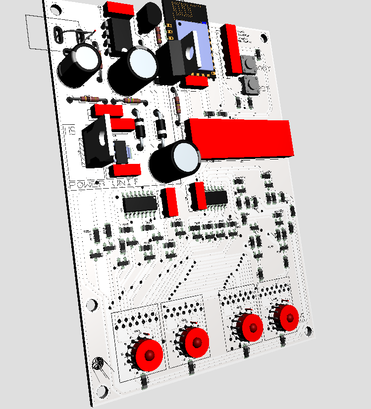
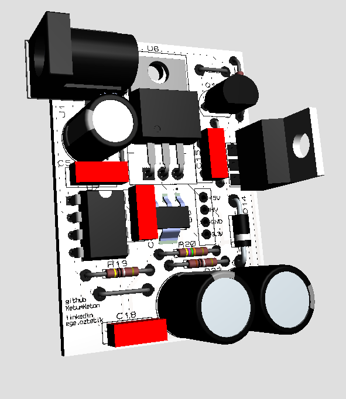

# Nixie-Tube-Driver-with-ESP8266
Nixie Driver for Nixie Clock and Display Project with Wifi.

# V5 Photos











# 🔥 Nixie Driver for Nixie Clock & Display

This project is a **Nixie tube driver** designed for **Nixie clock and display applications**, featuring **RTC (Real-Time Clock) support** and **RS485 communication**. The driver controls Nixie tubes for displaying time or numerical data while maintaining accurate timekeeping and supporting serial communication.

## 📌 Features

- 🕰 ~~**RTC Integration** – Keeps accurate time even when powered off.~~ (V4)
- ~~🔗 **RS485 Communication** – Enables long-distance and reliable data transmission.~~ (V4)
- 🔥 **Nixie Tube Control** – Supports various Nixie tube displays.  
- 🔄 **Adjustable Brightness & Effects** – Smooth transitions and dimming support.  
- 🔋 **Low Power Consumption** – Optimized for efficient operation.  
-  **Beautiful Design for PCB** – PCB has been designed with improved aesthetics (V4)
- **Wifi Connection and Real Time Clock Configuration** The ESP8266 Nixie driver includes an internal Wi-Fi module. It automatically connects to the internet to calibrate the clock. (V4)

## 🛠 Requirements

Ensure you have the following components and dependencies:

- **Microcontroller** (e.g., STM32, ATmega, ESP32, etc.)  (ESP8266)
- **Nixie Tubes** (e.g., IN-12, IN-14, IN-18, etc.) (This PCB designed for IN-16) 
- **Nixie HV Power Supply** (150V DC)  
- ~~**RTC Module** (DS1307)~~ (V4 ESP8266 has an internal RTC) 
- ~~**RS485 Transceiver** (MAX485)~~(V4 has wifi)

## 🔧 Installation & Setup

1. **Clone the repository**  
   ```sh
   git clone https://github.com/Ketonkeko/Nixie-Tube-Driver-with-RTC-RS485.git
   cd Nixie-Tube-Driver-with-RTC-RS485
   ```

2. **Get Gerber Files for Manufacturing**  
   - open the zip file and get drill and copper gerber files


## 📝 To-Do

- [X] Make Clock Program with ~~AT89C4051~~ ESP8266 E-12 (V4)
- [X] Make a smaller pcb with smd and ULN2003 IC
- [X] Make 3D Case for watch
- [X] Make PCB and program tests
- [X] make part list and price calculation
- [ ] make a local server on esp8266 and set alarm and timezone

**V6 Notes**
- Changed bottom copper pour from GND to 3.3V for improved EMC.
- Removed selectable 3.3V/5V power supply for shift registers.
- Added 3.3V pull-up to Output Enable (OE) pin.
- Changed AMS1117-3.3 input source from 12V to 5V.
- Updated Nixie under-light LEDs power supply to 5V.
- Added TVS diode to 3.3V rail for transient protection.
- Added series inductor to ESP power line for noise filtering.
- Repositioned ESP module to allow antenna overhang.
- Added 22k current-limiting resistors to Nixie anodes.
- Corrected power jack footprint to use slotted drills.
Note on HV Converter (MC34063):
- When using a 500pF capacitor, ensure the inductor value is 560µH or higher.
- For the fast recovery diode, you can use UF4007, MBR2200, or HER208.
- Note: I personally used HER208 in this build.

**V5 Notes**
- Integrated MC34063 DC-DC converter to replace the external transformer power supply. (V5.1)
- The anode driver error was corrected.
- Additional capacitors were added to the power supplies for filtering.
- Internal diodes were added to the power inputs.
- The PCB was redrawn to 80x100mm.
- The CD4094 was redrawn to SO16.
- Some traces were thickened.
- The pin header sizes were adjusted.
- The capacitors in the 402 package were converted to 603.
- The OLED display was placed in a more visible location.
- The resistors for the Nixie Blue LEDs were converted to 1206 packages.
- The socket size for the Nixie tubes was adjusted.

**V4 Notes**

- Microcontroller changed (from AT89C4051 to ESP8266)
- Removed RS485 communication and added wi-fi.
- Nixie Driver has drive 4 nixie tubes same time with 16 transistor. (Time Division Multiplexing)
- Added Bitmap for better design pcb.
- Changed package from DIP to SMD for manufacturing and size improvements.
- HV and 12V input connected to external power supply (transformer)
- Added OLED display pins as an alternative output option

## 📜 License

This project is licensed under the **MIT License**. See the [LICENSE](LICENSE) file for details.

## 🤝 Contributing

Contributions are welcome! Feel free to submit **pull requests** or open **issues**.
