<div align="right">
  <a href="README.en.md">🇬🇧 English</a> |
  <a href="README.md">🇹🇷 Türkçe</a>
</div>

# 🔥 Nixie Tube Driver with ESP8266

Wi-Fi bağlantılı, ESP8266 tabanlı Nixie tüp sürücü kartı. Nixie saat ve sayısal gösterge projeleri için tasarlanmıştır; interneti kullanarak saatini otomatik kalibre eder ve zaman bölmeli çoklama (time-division multiplexing) ile birden fazla tüpü aynı anda sürer.

<p align="center">
  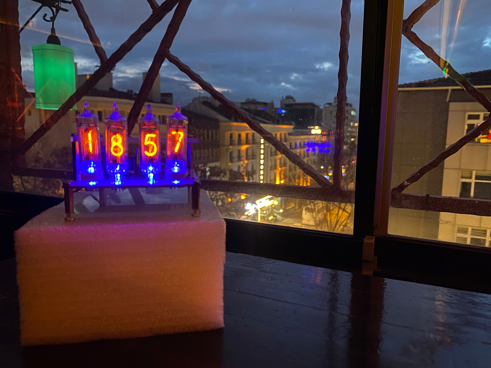
  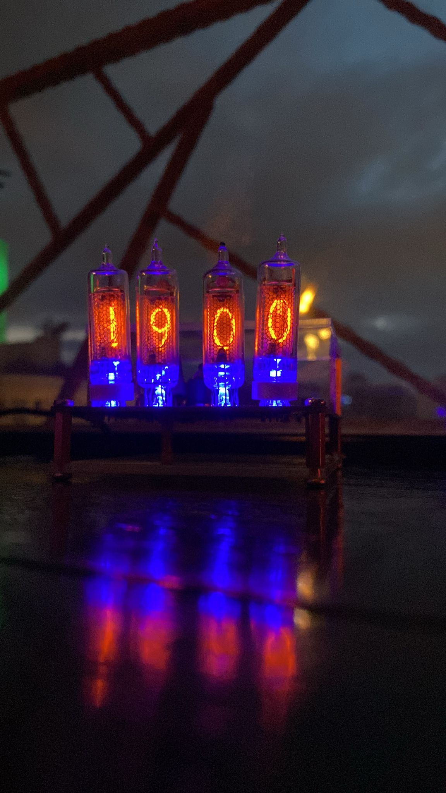
</p>
<p align="center">
    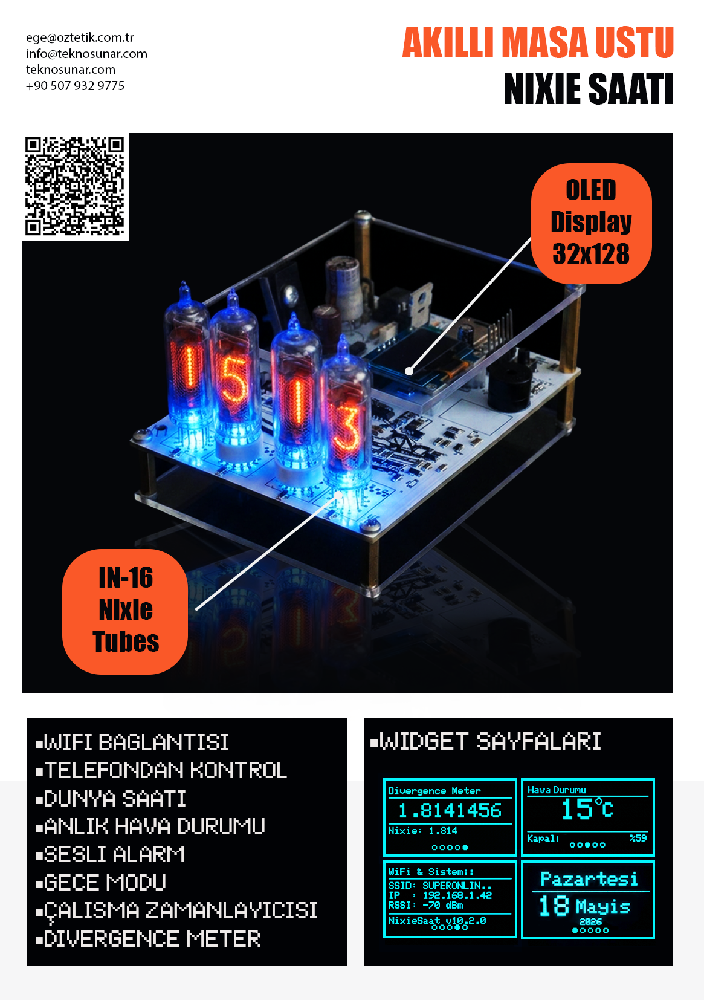
  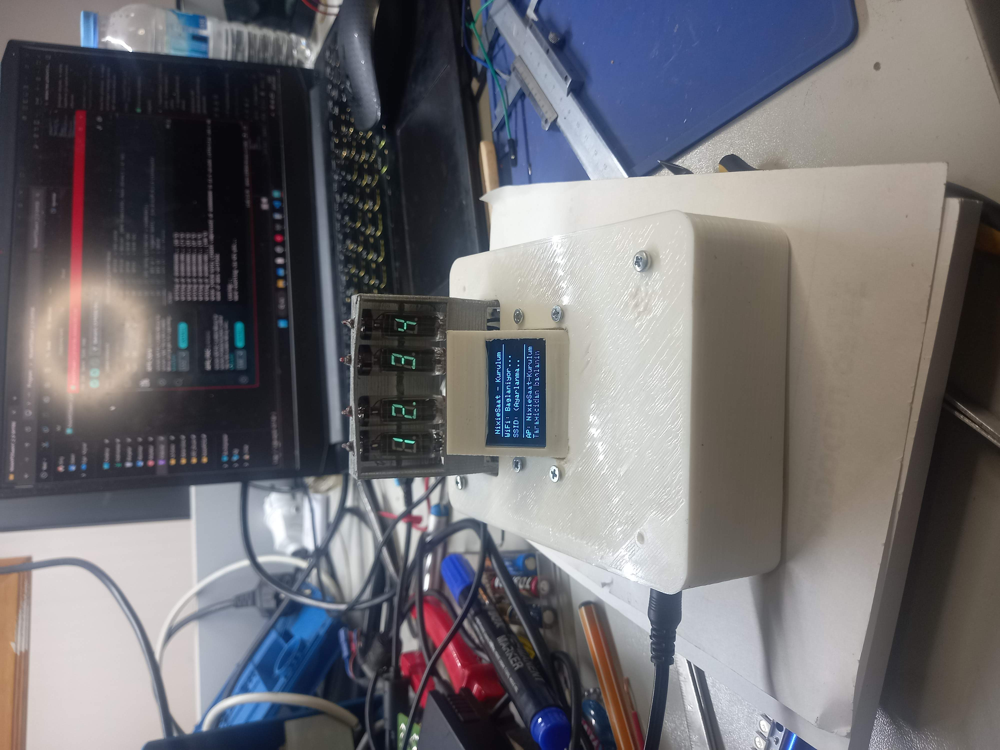
</p>
---

## 📖 İçindekiler

- [Proje Hakkında](#-proje-hakkında)
- [Özellikler](#-özellikler)
- [Donanım Gereksinimleri](#-donanım-gereksinimleri)
- [Kurulum ve Kullanım](#-kurulum-ve-kullanım)
- [Galeri](#-galeri)
- [Versiyon Notları](#-versiyon-notları)
- [Yol Haritası](#-yol-haritası)
- [Lisans](#-lisans)
- [Katkıda Bulunma](#-katkıda-bulunma)

---

## 🧭 Proje Hakkında

Bu proje, Nixie tüplerini (IN-16 için tasarlanmıştır, IN-12/IN-14/IN-18 gibi diğer tüplerle de uyumludur / Pro versiyonunda NEC-8051 / IV-3 VFD tüplerine uygun tasarımda bulunmaktadır) sürmek için gereken yüksek gerilim anahtarlama devresini, mikrodenetleyici firmware'ini ve PCB tasarımını bir arada sunar. Kart, ESP8266 üzerinden internete bağlanarak NTP ile saatini otomatik senkronize eder, böylece harici bir RTC pil değişimine veya manuel saat ayarına gerek kalmaz.

### Open Core - Community Edition
Açık kaynak felsefesine inandığım için, bu Nixie saatin temel versiyonunu herkesin kendi evinde yapabilmesi adına şemaları, kodları ve CAM dosyalarıyla v5.1 Comunity Edition olarak paylaşıyorum. Eğer kendi ESP8266'nızı programlamak, shift register'larla uğraşmak ve 170V DC-DC boost konvertör gibi yüksek voltajlı devreleri kendi başınıza kurmak istiyorsanız, ihtiyacınız olan her şey bu depoda mevcut!"

### Proffesional Edition
"Ancak, lehim yapmakla, parça tedarikiyle veya yüksek voltajla uğraşmak istemiyorsanız; çok daha gelişmiş bir web arayüzüne, ekstra animasyon modlarına ve kusursuz bir tasarıma sahip olan tam donanımlı versiyonu doğrudan tak-çalıştır bir ürün olarak satın almak isterseniz aşşağıdaki iletişim adresinden bana ulaşabilirsiniz.

Web Site: teknosunar.com / oztetik.com.tr
mail: info@teknosunar.com / ege@oztetik.com.tr
github: KetumKeton
linkedin: ege-oztetik

## ✨ Özellikler

**Donanım**
- 🔥 IN-16 Nixie tüpleri için optimize edilmiş sürücü devresi; diğer Nixie tipleriyle de uyumlu
- 🔄 4 tüpün aynı anda, zaman bölmeli çoklama (16 transistörlü anahtarlama) ile sürülmesi
- ⚡ Dahili MC34063 DC-DC çevirici ile 150V DC yüksek gerilim üretimi (harici trafoya gerek yok — V5 ve sonrası)
- 🔋 Düşük güç tüketimine göre optimize edilmiş anahtarlama tasarımı
- 🎨 Estetik odaklı, sıkı yerleşimli PCB tasarımı (80×100 mm, V5)
- 🖥️ İsteğe bağlı OLED ekran bağlantısı (alternatif/yardımcı çıkış)
- 🟦 Nixie tüpleri için mavi arka plan LED desteği

**Yazılım / Firmware**
- 📶 ESP8266 üzerinden otomatik Wi-Fi bağlantısı
- 🕒 İnternet üzerinden NTP ile gerçek zamanlı saat kalibrasyonu
- 💡 Ayarlanabilir parlaklık ve yumuşak geçiş/söndürme (fade) efektleri
- 🔌 Seri haberleşme desteği (test ve yapılandırma için)
- 🧩 CD4094 kaydırma yazmaçları üzerinden basamak sürme

## 🛠 Donanım Gereksinimleri

| Bileşen | Not |
|---|---|
| Mikrodenetleyici | ESP8266 (ESP-12) |
| Nixie Tüpleri | IN-16 için tasarlandı (IN-12, IN-14, IN-18 ile de uyumlu) |
| Yüksek Gerilim Kaynağı | 150V DC (V5'te kart üzerinde MC34063 ile üretilir) |
| Sürücü IC | CD4094 (kaydırma yazmacı), ULN2003 (küçük SMD versiyonda) |

## 🚀 Kurulum ve Kullanım

1. **Depoyu klonlayın**
   ```sh
   git clone https://github.com/Ketonkeko/Nixie-Tube-Driver-with-ESP8266.git
   cd Nixie-Tube-Driver-with-ESP8266
   ```

2. **Gerber dosyalarını üretim için alın**
   - İlgili versiyon klasöründeki zip dosyasını açın; içinden drill ve copper Gerber dosyalarını çıkarıp PCB üreticinize gönderin.

3. **Firmware'i yükleyin**
   - İlgili versiyon klasöründeki Arduino/ESP8266 projesini açın.
   - Wi-Fi ağı bilgilerinizi kod içinde ilgili değişkenlere girin.
   - Kartı USB-seri dönüştürücü ile bağlayıp firmware'i ESP8266'ya yükleyin.

4. **İlk çalıştırma**
   - Kart açıldığında tanımlı Wi-Fi ağına bağlanır ve NTP sunucusundan saati çeker.
   - Yüksek gerilim beslemesini (150V) ve tüp soketlerini bağlamadan önce devrenin güç kesici olduğundan emin olun.

> ⚠️ **Güvenlik uyarısı:** Bu kart 150V DC gibi tehlikeli seviyede yüksek gerilimle çalışır. Kartı yalnızca yüksek gerilim devreleriyle çalışma tecrübeniz varsa enerjilendirin.

## 🖼 Galeri

<table>
  <tr>
    <td align="center">
      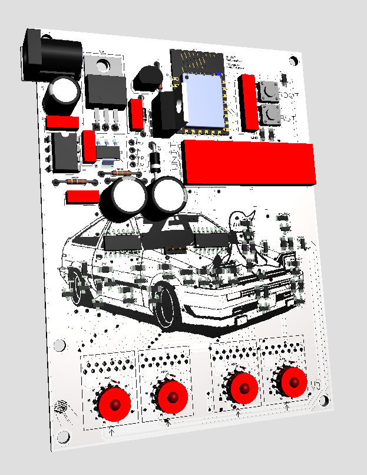<br>
      <sub>V5.2 — 3D model</sub>
    </td>
    <td align="center">
      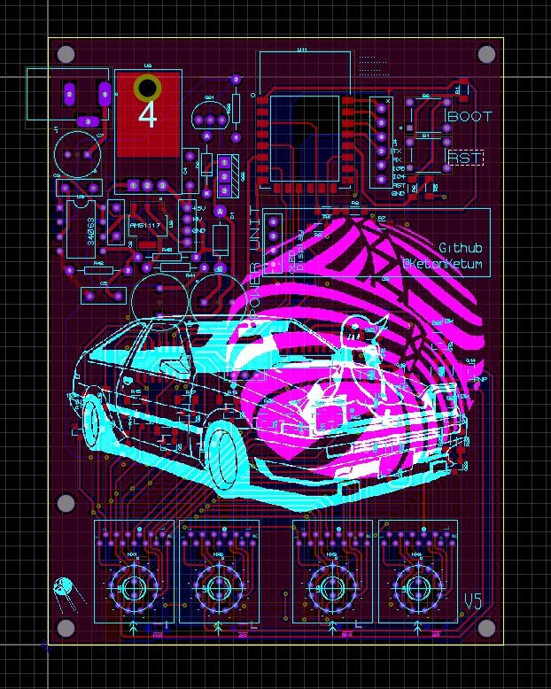<br>
      <sub>V5.2 — PCB düzeni</sub>
    </td>
  </tr>
  <tr>
    <td align="center">
      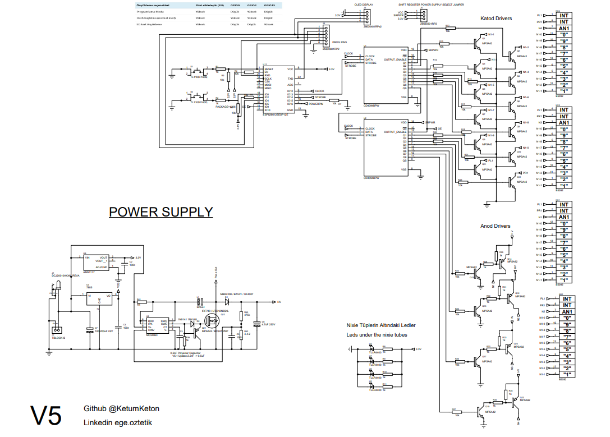<br>
      <sub>V5.2 — Şematik</sub>
    </td>
    <td align="center">
      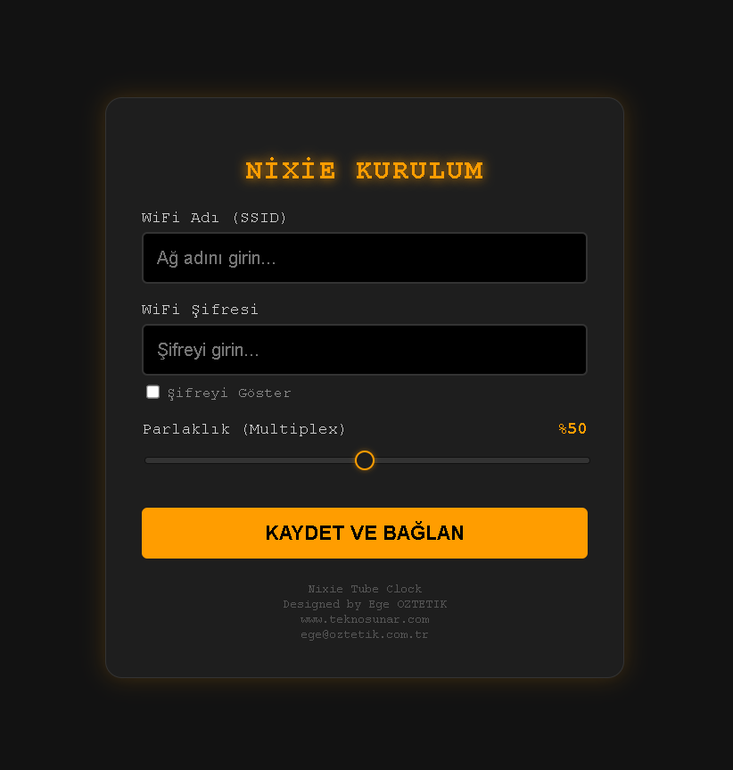<br>
      <sub>V4 — Örnek uygulama</sub>
    </td>
  </tr>
  <tr>
    <td align="center">
      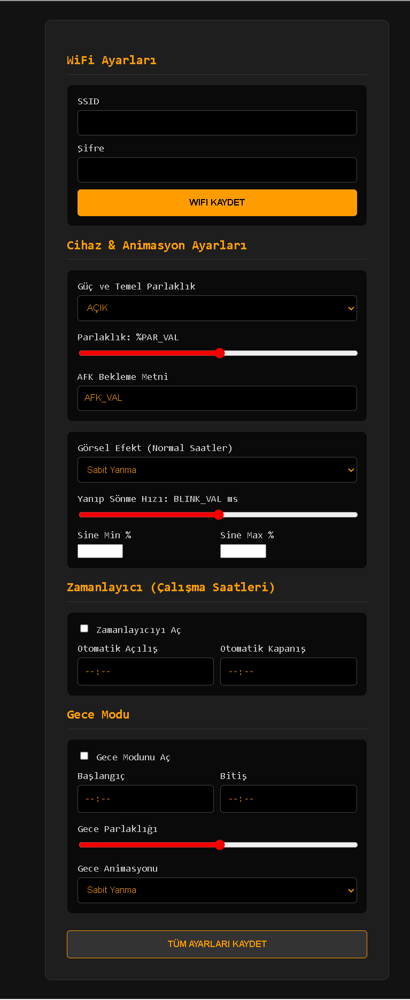<br>
      <sub>V6 — Örnek uygulama</sub>
    </td>
    <td align="center">
      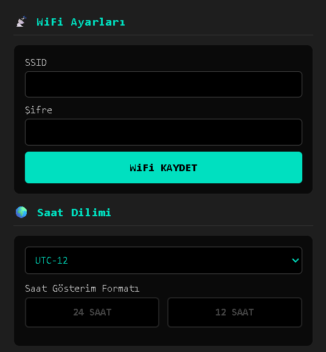<br>
      <sub>V6 — NEC LD8051 VFD test</sub>
    </td>
  </tr>
    <tr>
    <td align="center">
      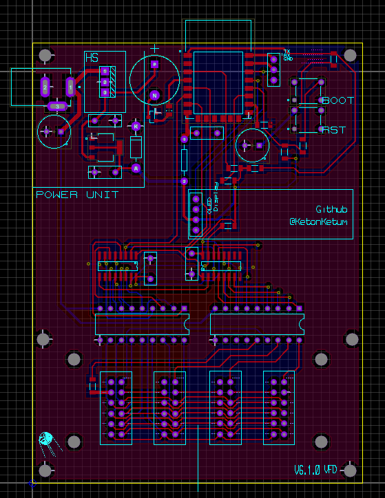<br>
      <sub>V6 — Örnek uygulama</sub>
    </td>
    <td align="center">
      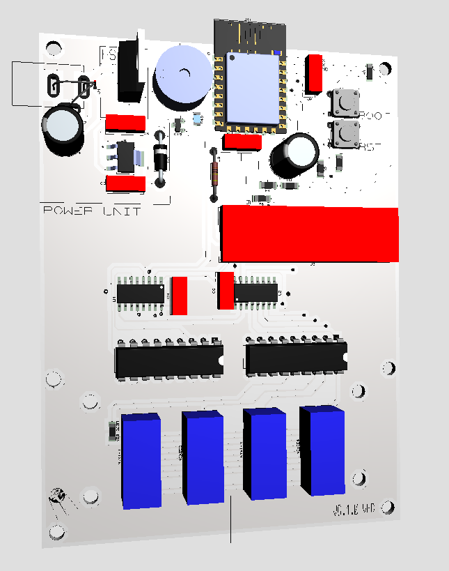<br>
      <sub>V6 — NEC LD8051 VFD test</sub>
    </td>
  </tr>
    <tr>
    <td align="center">
      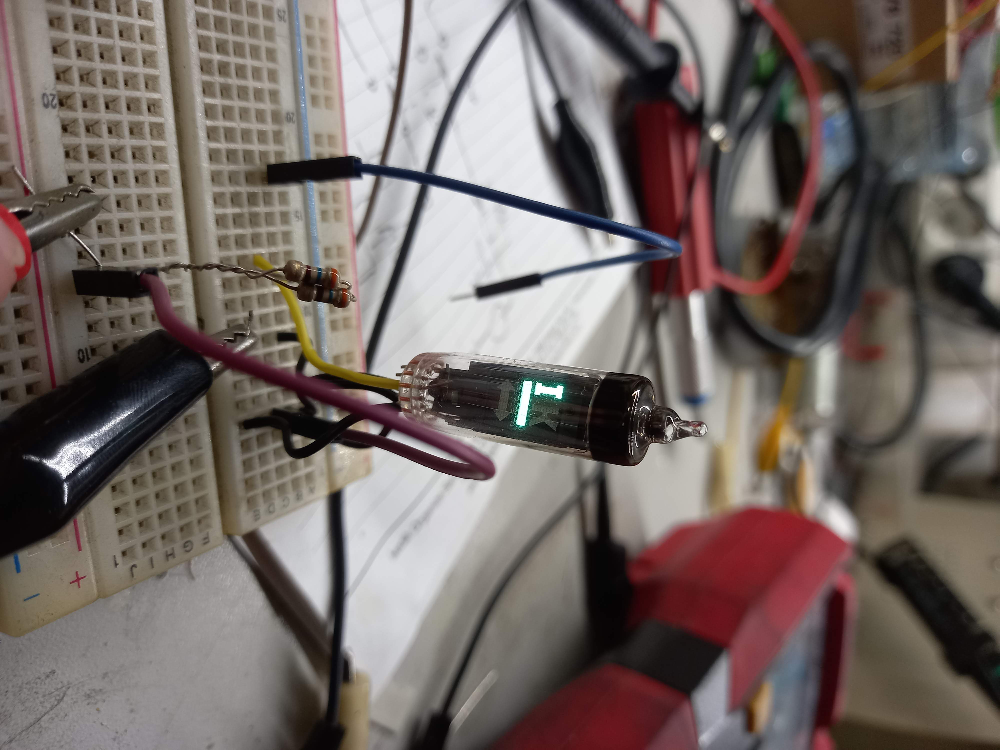<br>
      <sub>V6 — Örnek uygulama</sub>
    </td>
    <td align="center">
      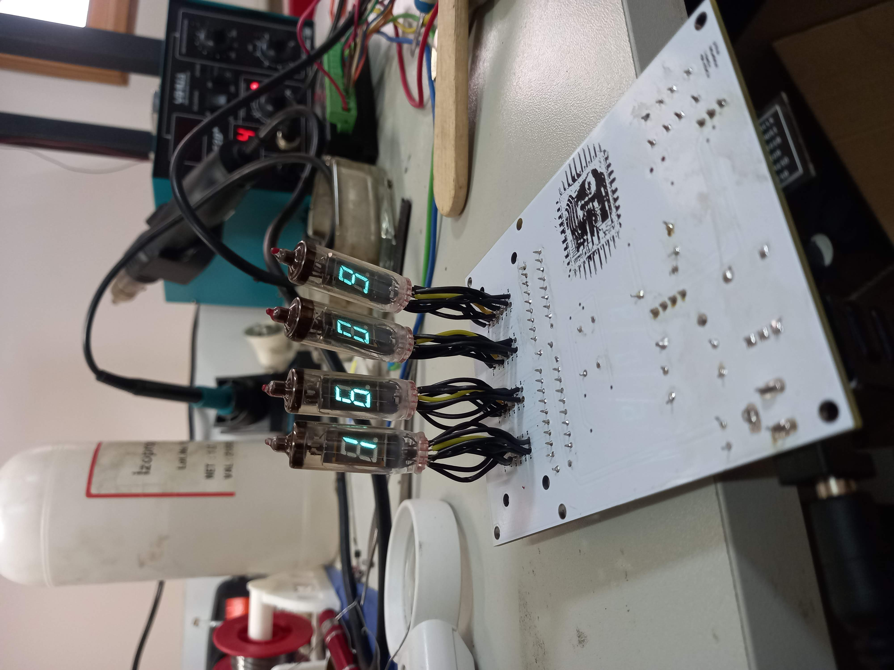<br>
      <sub>V6 — NEC LD8051 VFD test</sub>
    </td>
  </tr>
</table>

## 🗂 Versiyon Notları

### V6 — VFD Desteği
- NEC LD8051 VFD (vakum floresan gösterge) ile deneysel test desteği eklendi.

### V5 Notları
- Harici trafo yerine dahili MC34063 DC-DC çeviricisi entegre edildi.
- Anot sürücüsündeki hata giderildi.
- Güç filtrelemesi için ek kapasitörler eklendi.
- Güç girişlerine dahili diyotlar eklendi.
- PCB, 80×100 mm ölçüsünde yeniden çizildi.
- CD4094, SO16 paketine geçirildi.
- Bazı hatlar kalınlaştırıldı.
- Pin header boyutları güncellendi.
- 402 paket kapasitörler 603'e dönüştürüldü.
- OLED ekran daha görünür bir konuma taşındı.
- Nixie mavi LED dirençleri 1206 pakete dönüştürüldü.
- Nixie tüp soket boyutu güncellendi.

### V4 Notları
- Mikrodenetleyici AT89C4051'den ESP8266'ya değiştirildi.
- RS485 haberleşmesi kaldırılıp Wi-Fi eklendi.
- 16 transistörlü zaman bölmeli çoklama ile 4 tüpün eşzamanlı sürülmesi sağlandı.
- Daha iyi PCB tasarımı için bitmap desteği eklendi.
- Üretim ve boyut iyileştirmesi için paket DIP'ten SMD'ye değiştirildi.
- HV ve 12V girişleri harici güç kaynağına (trafo) bağlandı.
- Alternatif çıkış seçeneği olarak OLED ekran pinleri eklendi.

## 🗺 Yol Haritası

- [x] ESP8266 E-12 ile saat programının yazılması
- [x] SMD ve ULN2003 IC ile daha küçük PCB tasarımı
- [x] Saat için 3D kasa tasarımı
- [x] PCB ve program testleri
- [x] Parça listesi ve maliyet hesaplaması
- [ ] ESP8266 üzerinde yerel sunucu ile alarm ve saat dilimi ayarı

## 📜 Lisans

Bu proje **MIT Lisansı** ile lisanslanmıştır. Ayrıntılar için [LICENSE](LICENSE) dosyasına bakın.

## 🤝 Katkıda Bulunma

Katkılarınızı bekliyoruz! **Pull request** gönderebilir veya **issue** açabilirsiniz.
